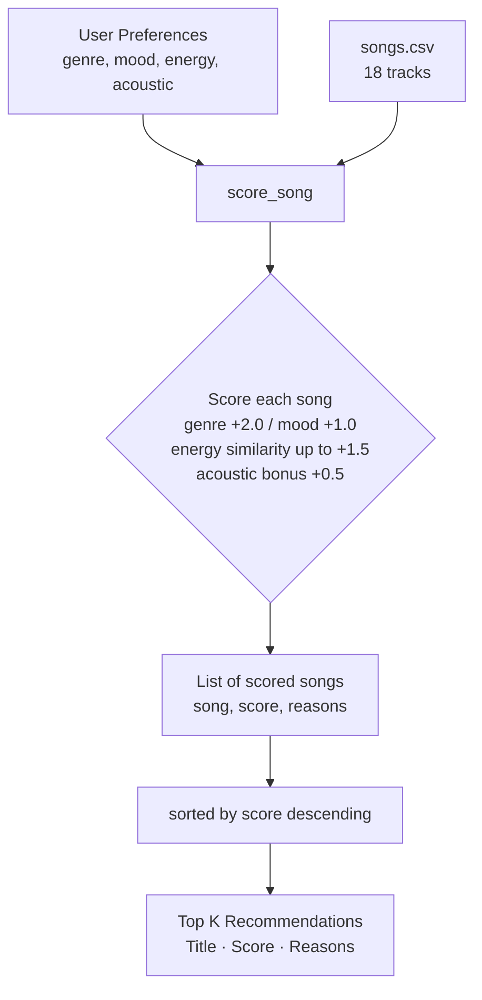
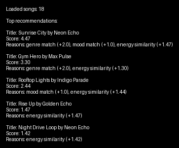

# Music Recommender Simulation

## Project Summary

VibeFinder 1.0 is a content-based music recommender that scores each song in a small CSV catalog against a user's stated preferences (genre, mood, energy, acoustic taste) and returns the top 5 ranked results with plain-English explanations for each recommendation.

---

## How The System Works

### How Real Recommendation Systems Work

Streaming platforms like Spotify and YouTube use two main techniques to decide what to play next. **Collaborative filtering** looks at patterns across millions of users — if people who liked Song A also tend to like Song B, the system recommends Song B to anyone new who likes Song A, even without analyzing the song's actual content. **Content-based filtering** works differently: it studies the song's own attributes (tempo, energy, mood, genre, acousticness) and matches those directly to a user's known taste profile, without needing any other users' data.

Real platforms combine both into hybrid systems. Spotify's "Discover Weekly" uses collaborative signals to find users with similar taste, then content signals to fine-tune which specific tracks to surface. This project implements a simplified **pure content-based** version, which is more transparent and easier to reason about, but cannot learn from how other people listen.

VibeFinder 1.0 prioritizes "vibe match" — it weights genre and mood as the most defining aspects of a user's taste, then uses energy level as a continuous similarity measure to find songs that feel close to the user's target intensity.

### Key Features Used

**Song attributes** (`data/songs.csv`):
- `genre` — categorical label (e.g., pop, lofi, rock, jazz)
- `mood` — categorical label (e.g., happy, chill, intense, melancholic)
- `energy` — float 0.0–1.0, overall intensity of the track
- `acousticness` — float 0.0–1.0, how acoustic vs. electronic the track is
- `tempo_bpm`, `valence`, `danceability` — loaded from CSV, available for future scoring

**User profile** (`UserProfile` / preference dict):
- `favorite_genre` — string matching a genre label in the catalog
- `favorite_mood` — string matching a mood label in the catalog
- `target_energy` — float 0.0–1.0, the intensity level the user wants
- `likes_acoustic` — boolean, whether to activate the acoustic bonus

### Data Flow



### CLI Output Example

Below is a screenshot of the recommendation output in the terminal for the default `pop/happy` profile.



### Algorithm Recipe

- **Genre Match**: +2.0 points if song genre matches user favorite (highest weight — genre is the most defining aspect of musical style)
- **Mood Match**: +1.0 point if song mood matches user favorite
- **Energy Similarity**: Up to +1.5 points — calculated as `1.5 * (1.0 - |song.energy - user.target_energy|)`, rewarding closeness rather than just high or low values
- **Acoustic Bonus**: +0.5 points if user prefers acoustic music and the song's acousticness > 0.5
- **Total Score**: Sum of the above; songs are ranked descending

### Potential Biases

This system might over-prioritize genre matches, potentially ignoring great songs that strongly match the user's mood or energy but have a different genre. It assumes categorical matches (genre/mood) are more important than numerical similarity, which may not reflect all user preferences. There is also no diversity enforcement — the same artist can fill multiple slots in the top 5.

---

## Getting Started

### Setup

1. Create a virtual environment (optional but recommended):

   ```bash
   python -m venv .venv
   source .venv/bin/activate      # Mac or Linux
   .venv\Scripts\activate         # Windows
   ```

2. Install dependencies:

   ```bash
   pip install -r requirements.txt
   ```

3. Run the recommender:

   ```bash
   python -m src.main
   ```

### Running Tests

```bash
pytest
```

---

## Experiments

### Three Diverse Profiles

| Profile | Genre | Mood | Energy | Top Result | Score |
|---|---|---|---|---|---|
| High-Energy Pop | pop | happy | 0.9 | Sunrise City | 4.38 |
| Chill Lofi | lofi | chill | 0.35 | Library Rain | 5.00 |
| Intense Rock | rock | intense | 0.92 | Storm Runner | 4.48 |

### Edge Case: Conflicting Preferences

Profile `genre: pop, mood: sad, energy: 0.9` — no sad pop songs exist in the catalog. The system silently returns happy/intense pop songs, demonstrating a failure mode where mood preference is ignored without any user-facing warning.

### Weight-Shift Experiment

Halving the genre weight (2.0 → 1.0) and doubling the energy weight (1.5 → 3.0x) caused positions 2 and 3 to swap: Rooftop Lights (mood+energy match) beat Gym Hero (genre match only), confirming the system is sensitive to weight changes.

See [reflection.md](./reflection.md) for detailed profile-by-profile comparison notes.

---

## Limitations and Risks

- Only works on a small catalog of 18 songs — niche genres like rock or metal have only 1 song each
- Does not use lyrics, language, release year, or artist popularity
- Cannot learn from listening history or adapt over time
- No diversity enforcement across artists
- Silent failure when a mood preference cannot be satisfied

See [model_card.md](./model_card.md) for full bias analysis.

---

## Reflection

Recommenders seem "smart" because they return a ranked list — but ranking is just arithmetic. The interesting part is deciding *what* to measure and *how much* each signal is worth. Choosing genre +2.0 vs. +1.0 points changed which songs appeared in the top 5 more dramatically than any other single decision. Real systems like Spotify are making thousands of such weight decisions, and those choices determine what music gets discovered or buried.

The most important lesson from this project: a system can return results that look reasonable while completely failing the user. The "sad high-energy pop" edge case showed that silence from a recommender is not the same as a good recommendation.

[**Full Model Card**](model_card.md) | [**Profile Comparison Notes**](reflection.md)
